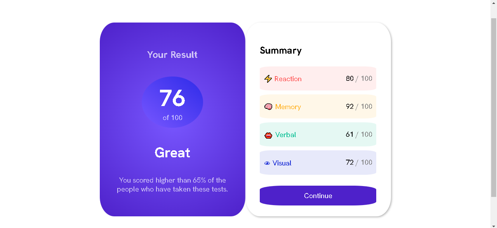
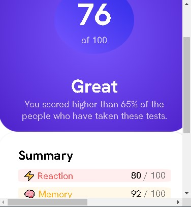

# Frontend Mentor - Results summary component solution

This is a solution to the [Results summary component challenge on Frontend Mentor](https://www.frontendmentor.io/challenges/results-summary-component-CE_K6s0maV). Frontend Mentor challenges help you improve your coding skills by building realistic projects. 

## Table of contents

- [Overview](#overview)
  - [The challenge](#the-challenge)
  - [Screenshot](#screenshot)
  - [Links](#links)
  - [Built with](#built-with)
  - [Continued development](#continued-development)
  - [Useful resources](#useful-resources)
- [Author](#author)

## Overview
  
  From my point of view, building this project came across me with a test made out of general knowledge that required not just being able to memorize some helful lesson for the outcome but also having the capability to understand vivdly what and how the whole process needs to be edited. During the process it felt very enriching and exciting that I had to approach the whole scheme using all the stuff that I had previously learnt, linking them logically untill the result will match the requirements.

### The challenge

Users should be able to:

- View the optimal layout for the interface depending on their device's screen size
- See hover and focus states for all interactive elements on the page
- **Bonus**: Use the local JSON data to dynamically populate the content

### Screenshot

### Links

- Solution URL: [Add solution URL here](file:///C:/Users/Marius/Desktop/results-summary-component-main/index.html#attribution)
- Live Site URL: [Add live site URL here](http://127.0.0.1:5500/)

### Built with

- HTML5 markup
- CSS custom properties
- Flexbox
- Mobile-first workflow

### Continued development

After managind to complete this projects with my relatively good knowledge of HTML and CSS I eager to keep on growing my skills as a future frontend developer. I am going to learn JS followed by some frameworks and libraries so that I can make a more efficient performance overall.

### Useful resources

- [Chat GPT](https://chat.openai.com/)
- [Stack Overflow](https://stackoverflow.com/) 

## Author

- Frontend Mentor - [@AlexCristea2007](https://www.frontendmentor.io/profile/AlexCristea2007)

